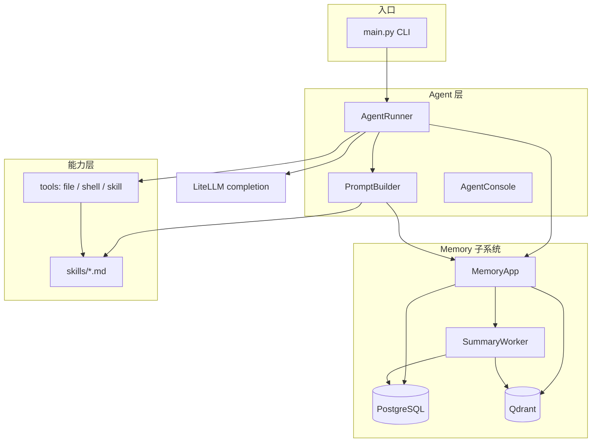
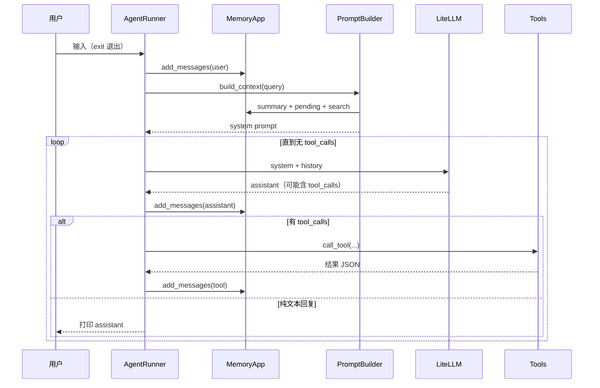

# MultiClaw

面向本地的交互式 AI Agent：通过 LiteLLM 调用大模型，配合工具（文件、Shell、Skill）完成任务，并用 PostgreSQL + Qdrant 实现可恢复的会话记忆与长期摘要。

## 设计思想

### 目标

在单机 CLI 场景下，把「对话 Agent」「工作区工具」「可检索记忆」三件事拆开又串起来：对话要稳（中断可恢复）、工具要可控（工作区与命令白名单）、记忆要可扩展（原文 + 摘要 + 向量检索）。

### 分层职责

| 层级 | 模块 | 职责 |
|------|------|------|
| 入口 | `main.py` | 解析 `--workspace`、`--session-id`，加载 `docker/.env` |
| 编排 | `agent/runner.py` | 会话生命周期、LLM 循环、工具执行、消息落库 |
| 提示 | `agent/prompt.py` | 拼装 system prompt（基础说明、Skills、工作区、长期记忆） |
| 记忆 | `memory/` | PostgreSQL 主存储、Qdrant 向量索引、后台 SummaryWorker |
| 能力 | `tools/`、`skills/` | 文件/目录、Shell、按需加载 Skill 文档 |

`main.py` 只做 CLI；运行状态收敛在 `AgentRunner`，避免入口文件膨胀。

### 双存储：主库 + 派生索引

- **PostgreSQL（Tortoise ORM）** 是会话与对话的**唯一真相源**：`session`、`history`、`memory`（长期摘要）。
- **Qdrant** 是**可重建的派生索引**：用于按当前用户问题检索相关 history / summary。
- 写入顺序：`history` 先落 PG → upsert Qdrant → 标记 `indexed_at`。进程在中间任一步崩溃时，启动时 `reindex_unindexed()` 会幂等补齐索引。

### 进程内 history 与持久化 memory

- `AgentRunner.history`：仅服务**当前进程**内多轮 tool call 的 LLM 上下文；**重启不从这里恢复**。
- `MemoryApp`：每条 user / assistant / tool 消息**增量写入**数据库，便于崩溃后根据「最后一条 history」判断状态。
- 每轮用户提问前，`PromptBuilder` 通过 `build_context()` 把**长期 summary、未压缩的 pending history、向量检索结果**注入 system prompt，而不是把全量 history 塞进 messages。

### 崩溃恢复：保守、不重放

典型中断：用户消息已写入，但 LLM / 工具 / assistant 保存尚未完成，最后一条 `history.role == user`。

恢复策略（`repair_incomplete_turn`）：

1. 只补一条 assistant 说明（「上一轮因中断未完成，请重新发送」）。
2. **不**重新调用 LLM，**不**重新执行工具——避免文件写入、Shell 等副作用重复发生。

启动时还会 `reindex_unindexed()`，修复「DB 已有记录但 Qdrant 未索引」的状态。

### 长期记忆：后台压缩

当 `summary_tokens + pending_history_tokens` 超过 `model_max_context_tokens × summary_trigger_ratio` 时，`SummaryWorker` 被唤醒：

- **最近窗口**内的 history 保持原文（条数与 token 双上限）。
- 更早的 history 分批交给单独的 summary LLM 压成 `Memory.summary`，并标记 `is_summarized=True`。
- 工具类 message 不参与摘要文本，减少噪声；原文仍保留在库中供检索。

### Skills：说明与执行分离

`skills/*/SKILL.md` 带 frontmatter（name、description）。启动时只把**摘要列表**放进 system prompt；模型需要细节时通过 `load_skill` 工具读取全文，避免 token 浪费。

### 工具与安全

- **工作区**：指定 `--workspace` 后，文件类工具路径限制在该目录内；未指定工作区则**禁用**全部文件工具，并在 prompt 中明确告知模型。
- **Shell**：命令经 `shlex` 拆成参数列表，`subprocess.run(..., shell=False)`，**不经系统 shell 解释**（见文末说明）。默认白名单为 `curl`、`summarize`；名单外命令需终端人工确认。可通过 `SHELL_TOOL_ALLOWED_COMMANDS` 扩展。

## 架构概览



## 执行过程

### 1. 启动与准备

```
uv run python main.py [--workspace PATH] [--session-id UUID]
```

1. 加载 `docker/.env`（数据库、Qdrant、LLM、Memory 相关变量）。
2. `MemoryApp.initialize()`：建表、确保 Qdrant collection、启动 `SummaryWorker`。
3. `ensure_session`：新建或恢复 session，绑定 `workspace`。
4. `configure_file_workspace` / `configure_shell_workspace`：把路径约束注入工具层。
5. `repair_incomplete_turn`：若上一轮停在 user，补恢复说明。
6. `reindex_unindexed`：补齐未索引的 history / memory。

### 2. 交互循环（单轮用户输入）



要点：

- **user 消息先落库**，再构建 prompt、再调模型。
- **assistant 每条也落库**，避免「模型已回复但进程在 tool 循环中崩溃」时丢失回复。
- 有 `tool_calls` 时在同轮内继续请求 LLM，直到返回无工具调用的 assistant 文本。
- `history` 在进程内追加；持久化失败只告警，不阻断对话（但记忆可能不完整）。

### 3. 记忆如何进入模型

每轮 `PromptBuilder.build()` 调用 `MemoryApp.build_context()`，拼接三类信息：

1. 当前 session 的 **Memory.summary**（已压缩的长期记忆）。
2. **pending history**（`is_summarized=False` 的原文片段）。
3. **Qdrant 检索**与当前用户问题相关的 history / summary 条目。

结果以 `## Relevant Long-Term Memory` 追加到 system prompt；与 `AgentRunner.history`（本轮多步 tool 的短期上下文）分工明确。

### 4. 数据模型（PostgreSQL）

| 表 | 用途 |
|----|------|
| `session` | 会话 id、user_id、workspace |
| `history` | 逐条对话（user/assistant/tool/system），含 `token_count`、`is_summarized`、`indexed_at` |
| `memory` | 每个 session 聚合的长期 summary 及来源 history id |

## 目录结构

```
multiclaw/
├── main.py              # CLI 入口
├── agent/               # Runner、Prompt、控制台
├── memory/              # 配置、仓储、Qdrant、SummaryWorker
├── tools/               # 文件、Shell、Skill 工具实现
├── skills/              # SKILL.md 能力说明（weather、summarize 等）
└── docker/              # Postgres、Qdrant compose 与 .env 示例
```

## 运行

```shell
# 1. 复制并编辑环境变量（可参考 docker/.env.example）
cp docker/.env.example docker/.env

# 2. 启动数据库与向量库
cd docker
docker compose -f docker-compose.yaml up -d

# 3. 回到项目根目录，启动 Agent（建议指定工作区以启用文件工具）
cd ..
uv run python main.py --workspace /path/to/your/project

# 可选：继续已有会话
uv run python main.py --workspace /path/to/your/project --session-id <uuid>
```

主要环境变量（完整列表见 `docker/.env.example` 与 `memory/config.py`）：

| 变量 | 说明 |
|------|------|
| `DATABASE_URL` | PostgreSQL 连接串（必填） |
| `QDRANT_URL` / `QDRANT_API_KEY` | 向量库 |
| `LLM_MODEL` / `LLM_BASE_URL` / `LLM_API_KEY` | 对话模型（LiteLLM） |
| `MEMORY_USER_ID` | 多用户隔离时的用户 id，默认 `default_user` |
| `MEMORY_*` | 摘要触发比例、批次 token、检索条数等 |

交互中输入 `exit` 结束进程；`SummaryWorker` 随 `MemoryApp.close()` 一并停止。

## Shell 工具说明

`The command is not run through a system shell` 表示：程序不会把整段命令交给 `cmd.exe`、PowerShell、bash 去解释，而是：

```python
# 不会这样
subprocess.run(command, shell=True)

# 而是拆成参数列表直接执行
subprocess.run(["curl", "wttr.in/Beijing?format=3"], shell=False)
```

因此 `&&`、管道、重定向等 shell 语法**不会生效**；`execute_shell_command` 只运行白名单中的可执行文件本身（如 `curl`），降低模型被诱导执行链式命令的风险。未在白名单中的命令会在终端弹出确认（Rich Panel + Confirm）。

## 技术栈

- Python 3.12+，`uv` 管理依赖
- [LiteLLM](https://github.com/BerriAI/litellm) 统一模型调用
- [Tortoise ORM](https://tortoise.github.io/) + asyncpg → PostgreSQL
- [Qdrant](https://qdrant.tech/) 向量检索（当前 embedding 为可复现的 hash 实现，便于本地开发）
- [Click](https://click.palletsprojects.com/) CLI、[Rich](https://github.com/Textualize/rich) 终端 UI
